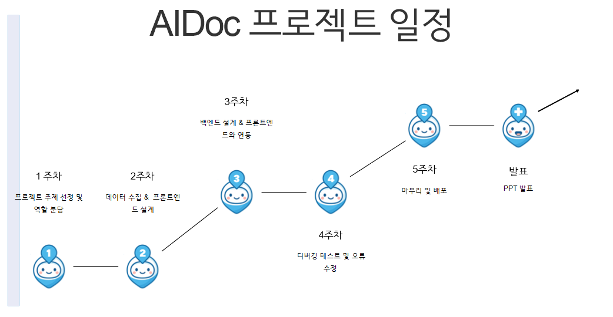
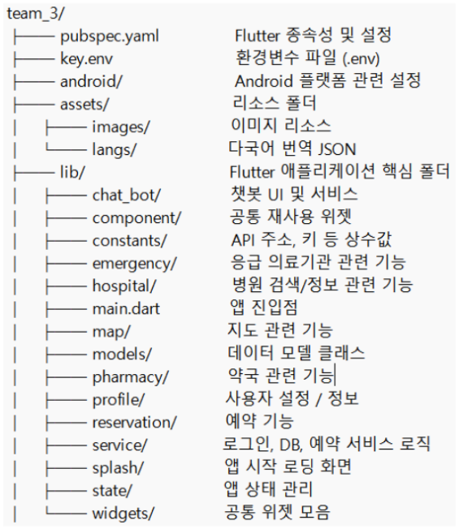
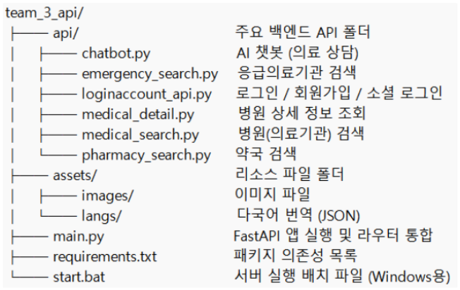
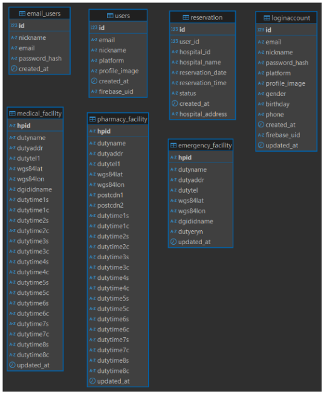

<p align="center">
  
</p>

<h2 align="center">
  <a href="https://www.miricanvas.com/v2/design/14sn1sc"> 프로젝트 프레젠테이션 바로가기</a> |
  <a href="https://drive.google.com/file/d/1MhasaOzK1Pg_NXxBwm1zFMubR9NLMpwg/view?usp=drive_link"> 프로젝트 시연 동영상 보기</a>
</h2>

  


**AIDoc – 실시간 의료정보 길잡이**  
Flutter · FastAPI · Navermap/google gemini API를 활용해  
사용자 위치 기반으로 병원·약국·응급실 정보를 실시간 제공하고,  
다국어 번역·예약·챗봇 기능을 통합한 모바일 앱입니다.

---

## 📋 목차
1. [프로젝트 개요](#프로젝트-개요)  
2. [문제 정의 & 기획 의도](#문제-정의--기획-의도)  
3. [주요 기능](#주요-기능)
4. [기술 스택](#기술-스택)
5. [프로젝트 일정](#프로젝트-일정)  
6. [팀원 소개](#팀원-소개)  
7. [디렉터리 구조](#디렉터리-구조)  
8. [데이터베이스 ERD](#데이터베이스-erd)  
9. [설치 및 실행](#설치-및-실행)  
10. [사용자 피드백 및 개선사항](#사용자-피드백-및-개선사항)  
11. [향후 발전 방향](#향후-발전-방향)  
12. [개발 과정과 배운 점](#개발-과정과-배운-점)  
13. [라이선스](#라이선스)  

---

## 🎯 프로젝트 개요
- **앱명**: AIDoc  
- **설명**: 위치 기반 의료 서비스 접근성 혁신 앱  
- **목표**: 사용자가 언제 어디서나 간편하게 주변 의료기관 정보를 조회·예약하고, 외국인도 편리하게 이용할 수 있도록 다국어 번역 및 챗봇 기능 제공  
- **스택**: Flutter · Dart · FastAPI · Naver Maps API · Google Gemini API

---
## 기술 스택
** Backend**

  

** Frontend **

 

** Database & AI**

  

** Infrastructure **

  

** Authentication**

   


---

## ❗️ 문제 정의 & 기획 의도
1. **의료 정보 접근성 문제**  
   - 기존 지도 앱은 단순 위치만 제공, 실시간 운영 여부·대기 정보 미반영  
   - 다국어 지원 및 예약 시스템 연동 부재 → 외국인·긴급상황 시 불편  

2. **기획 의도**  
   - 실시간 운영·거리순 필터, 진료과목·전화번호 등 상세정보 제공  
   - 다국어 자동 번역, 소셜 로그인·비회원 모드로 진입 장벽 최소화  
   - 챗봇을 통한 안내·예약 기능 연동

---

## 🚀 주요 기능
- **내 주변 의료기관 검색·필터링**  
  - 병원·약국·응급실 포함, 운영 중 여부·거리순 필터  
  - 진료과목, 전화번호, 운영시간 등 상세 정보  

- **다국어 자동 번역**  
  - 한국어·영어·중국어 등 실시간 번역 지원  

- **간편 로그인 & 비회원 모드**  
  - Google·Kakao·Naver 로그인, 비회원도 바로 사용 가능  

- **예약 시스템 연동**  
  - 선택한 기관으로 바로 예약, 예약 현황 조회·취소  

- **챗봇 안내·예약**  
  - 퀵버튼·입력창 형태의 대화 UI로 손쉬운 문의 및 예약  

- **UI/UX**  
  - Splash → 로딩 → 메인 화면  
  - 반응형 레이아웃, 직관적 네비게이션 카드 구성  

---

## 🗓️ 프로젝트 일정


---

## 🧑‍💻 팀원 소개
| 이름     | 담당 역할                                                  |
| :------: | :--------------------------------------------------------- |
| **김재혁** | 프로젝트 일정 관리 · 로그인/경로 안내 기능 구현               |
| **김재원** | 다국어 번역 · AI 챗봇 · API 검색 기능 구현                    |
| **김만재** | 앱 레이아웃 설계 · 예약 시스템 구현 · Flutter 위젯 구조 설계  |

---

## 📂 디렉터리 구조
- **frontend**

- **backend**


---

## 🗄️ 데이터베이스 ERD
- **LoginAccount** : 사용자 정보 저장  
- **Reservation**  : 예약 정보 저장  
- **HospitalFacility** : 병원 정보 저장  
- **PharmacyFacility** : 약국 정보 저장  
- **EmergencyFacility** : 응급 의료기관 정보 저장
- 

---

## ⚙️ 설치 및 실행
1. **저장소 클론**  
   ```bash
   git clone https://github.com/kim-manjae/AIDoc.git

   cd AIDoc/backend
pip install -r requirements.txt
uvicorn main:app --reload --port 8000

cd ../frontend
flutter pub get
flutter run

---

## 📝 사용자 피드백 및 개선사항
- 1.**데이터 정확성 향상**
- 실시간 운영 정보 업데이트
- 리뷰 시스템 도입, 전문의 정보 상세화

- 2.**UI/UX 개선 요청**
- 메뉴 구성 직관화, 다크 모드·글자 크기 조절

- 3.**기능 확장 제안**
- 추가 언어 지원, 원격 진료 연계, 오프라인 모드

- 4.**성능 개선**
- 검색 속도 최적화, 배터리 소모 감소

---

## 🌱 향후 발전 방향

- 1.**사용자 리뷰 기반 평점 시스템**
- 2.**AI 챗봇 실시간 예약 연동**
- 3.**개인 건강 기록(PHR) 통합 관리**
- 4.**의료 빅데이터 분석 서비스**

---

## 📜 라이선스
MIT License © 2025 김만재
